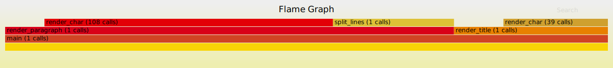

# No Nonsense Flamegraphs

A super simple library for figuring out where your program is spending its time by generating a
flame graph svg.

To use it:

1. Mark which functions (or other code blocks) you want to trace in your Rust code with
   `outln!("LABEL")`.
2. Run your program.
3. A flamegraph will have been saved at `flamegraph.svg` in your crate root. View it to see what
   fraction of its time your program spent in each `outln!`ed function, recursively.

## What, _exactly_, is a flame graph?

A flamegraph for a run of a text rendering program might look like this:

See the deep red `render_char (108 calls)` span at the top left? Its width is 48% of the total
width, because the program spent 48% of its time with the call stack
`main; render_paragraph; render_char`. The `108 calls` parenthetical means that there were 108
separate calls to the `render_char` function that totalled to 48% time spent. These 108 calls are
lumped together. Notice, however, that there is _another_ group of calls to `render_char` at the
right: 39 calls with the stack `main; render_title; render_char`. Calls are lumped together when
they have the same call stack.

For more details, there is a good overview of flame graphs in this readme for a different project
called [flamegraph-rs](https://github.com/flamegraph-rs/flamegraph#systems-performance-work-guided-by-flamegraphs).

## How do I use this crate?

It's really really simple. Mark each of the functions you want to trace with `outln!("LABEL")`:

    use no_nonsense_flamegraphs::outln;
    
    fn myExistingFunctionRelatedToKittens() {
      outln!("kittens"); // measures the span from now until it's dropped
      // existing kitten related functionality
    }

More precisely, the `outln!` macro will measure the span of time from when it is called to when it
is dropped at a closing curly brace. Most often you'll want to put it as the first statement in a
function call, but you can put it in any block you want to measure.

Once the `outln!` calls in are place, run your program and a flame graph marked with your LABELs
will be saved at `flamegraph.svg` in your repo root. The library will write to `stderr` if it is
unable to create the file.

It's safe to trace pretty hot loops. The overhead of a call to `outln!` in `--release` mode is only
about 70ns on my laptop. However, _do not trace deeply recursive functions_, as they are liable to
make large and unweildy flame graphs, and possibly even cause errors (printed to `stderr`) while
this library tries to convert the trace to an SVG.

## Acknowledgements

This crate is derived from [Commure/Stencil](https://github.com/commure/stencil). It has fewer
features, but a simpler interface. If you want additional features, like flamecharts or async
support, open an issue and I may port them, or just use `stencil` instead.
